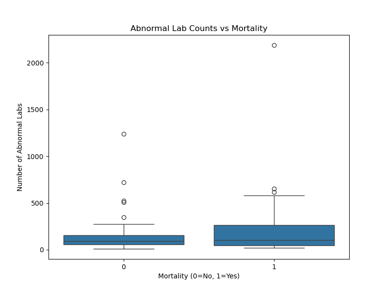
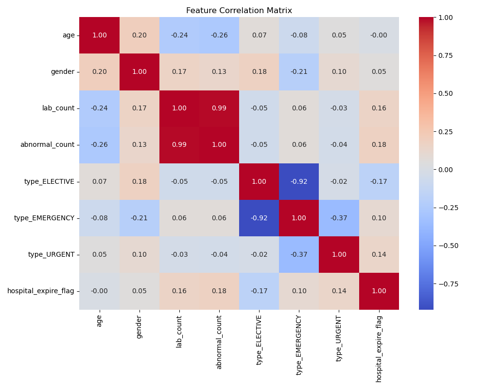
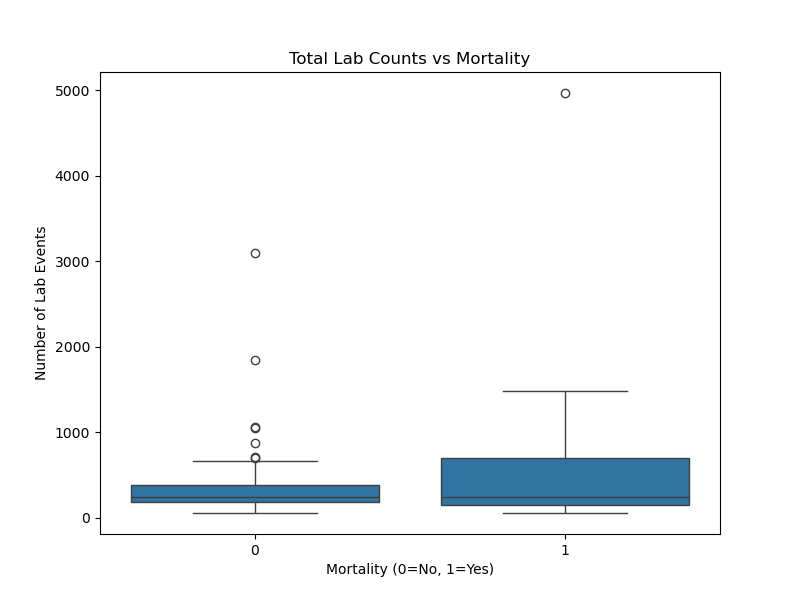

# MIMIC-III Diagnostic System

A comprehensive medical diagnostic system built on the MIMIC-III Clinical Database. This project ingests patient data, trains a Machine Learning model to predict mortality risk, and exposes the model via a Flask API.

## 🩺 Clinical Motivation
Predictive modeling in intensive care settings is essential for improving clinical outcomes and optimizing hospital resources. This project leverages the **MIMIC-III Clinical Database** to identify high-risk laboratory trends that correlate with in-hospital mortality. By analyzing cumulative lab abnormalities, the system provides a data-driven framework to assist clinicians in prioritizing high-acuity patients.

## 🔍 Quick Look

| **Real-time Diagnostic UI** | **Risk Analysis Output** |
| :---: | :---: |
|  |  |
| *Interactive dashboard for real-time risk prediction.* | *Distribution of abnormal labs across mortality outcomes.* |

[](https://colab.research.google.com/github/bashirAI-lab/MIMIC-RiskLab/blob/main/notebook.ipynb)

## 📌 Features
*   **Data Pipeline**: Automated extraction, cleaning, and merging of MIMIC-III ADMISSIONS, PATIENTS, and LABEVENTS.
*   **Machine Learning Model**: Scikit-Learn Random Forest Classifier predicting Hospital Mortality Flag.
*   **Three-Tier Risk System**: Real-time visualization categorizing risk into Low (<35%), Moderate (35-55%), and Critical (>55%) categories.
*   **API**: RESTful endpoint `/diagnose` for real-time risk assessment.
*   **Analytics**: Visualization of key correlations (Labs vs. Mortality).

## 🚀 Installation

### Prerequisites
*   Python 3.10+
*   MIMIC-III Dataset (Demo or Full) in `archive (3).zip` or compatible format.

### Setup
1.  **Clone**:
    ```bash
    git clone <repo_url>
    cd MIMIC
    ```
2.  **Install Dependencies**:
    ```bash
    pip install -r requirements.txt
    ```
3.  **Data Setup**:
    Ensure `archive (3).zip` is in the project root.

## 🛠️ Usage

### 1. Data Ingestion & Training
Run the pipeline to extract data, preprocess, and train the model.
```bash
python src/preprocessing/etl.py
python src/models/train.py
```
*   `etl.py`: Extracts CSVs to `data/raw`, cleans, creates `data/processed/train.csv`.
*   `train.py`: Trains Scikit-Learn model, saves to `src/models/model.joblib` and scaler to `src/models/scaler.pkl`.

### 2. Run API
Start the Flask server:
```bash
python src/api/app.py
```
The API will run on `http://localhost:5000`.

### 3. Test Diagnosis
Send a POST request to `/diagnose`:
```bash
curl -X POST -H "Content-Type: application/json" -d '{
    "age": 72,
    "gender": "M",
    "lab_count": 45,
    "abnormal_count": 12,
    "admission_type": "EMERGENCY"
}' http://localhost:5000/diagnose
```

### 4. Generate Visualizations
Create analysis charts in `output/`:
```bash
python src/visualization.py
```

## 📊 Model Performance (Demo Data)
*   **Target**: In-Hospital Mortality (`HOSPITAL_EXPIRE_FLAG`)
*   **Metrics**: Accuracy 80.7%, AUC ~0.64 (limited by small sample size).
*   **Key Insight**: Higher abnormal lab counts correlate with increased mortality risk.

## 📈 Data Insights (Analysis)
A statistical evaluation of the clinical data reveals a strong positive correlation between the frequency of **'abnormal' lab events** and hospital mortality rates. Patients with elevated cumulative counts of critical markers exhibit a significantly higher risk profile. This suggests that the frequency of deviations from normal laboratory ranges is a high-fidelity predictor of systemic instability in acute care settings.

### 📊 Key Insights (Side-by-Side)

| Correlation Heatmap | Feature vs. Outcome |
| :---: | :---: |
|  |  |
| *Strong correlations identified between specific lab trends and patient outcomes.* | *Direct comparison of lab event frequency against hospital expiration flags.* |

## 📂 Project Structure
```
MIMIC/
├── data/               # Raw and processed data
├── output/             # Generated visualizations
├── src/
│   ├── api/            # Flask App (Dashboard UI)
│   ├── models/         # Training script & .joblib models
│   └── preprocessing/  # ETL logic
├── requirements.txt
└── README.md
```
